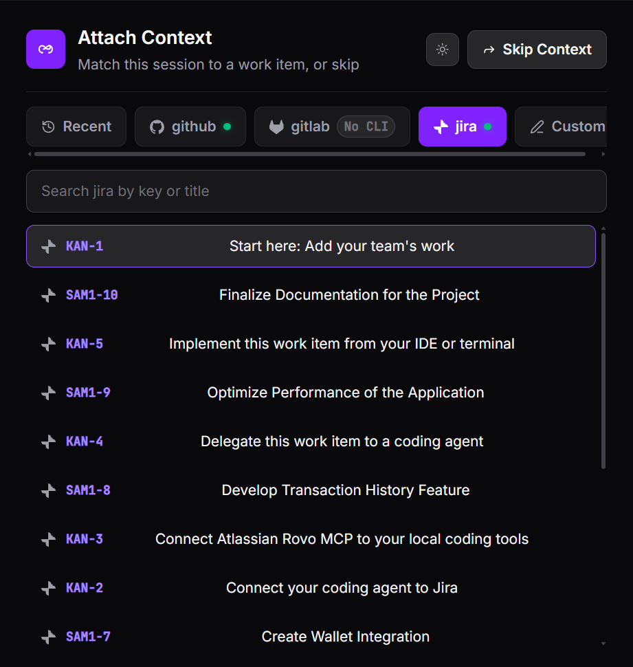
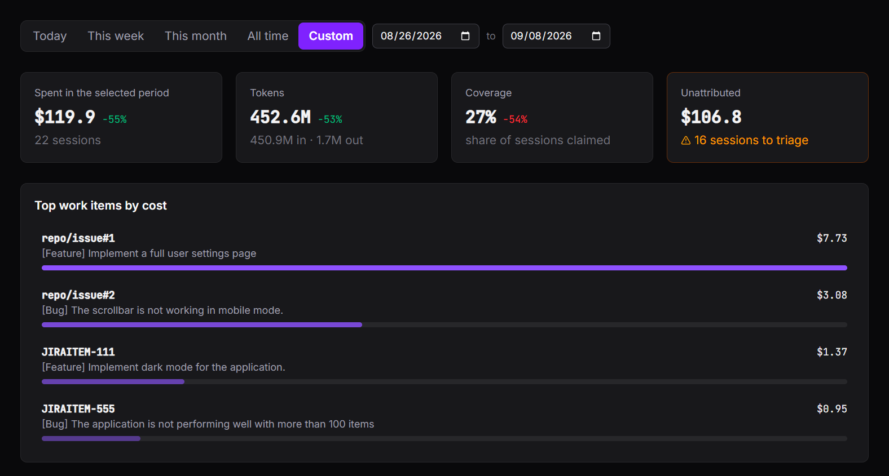

#  traceknot

<p>
  <a href="https://github.com/joroden/traceknot/releases"></a>
  <a href="LICENSE"></a>
  <a href="https://traceknot.com"></a>
</p>

**Know what every work item actually cost.** traceknot is a local telemetry
collector for AI coding agents (Claude Code, Codex CLI, Copilot CLI, VSCode
Copilot Chat). It ties each session back to a GitHub/GitLab/Jira issue and
gives you a dashboard of real cost and activity per task — no account,
nothing leaves your machine.

Beyond the top-line number, you can open any session and see where it actually
went — which step ran long, where the agent stalled or looped, and what each
part cost — so you know exactly where the time and money went, not just how
much.

**Claim the work item.** Every agent session pauses until it's attached to a
GitHub, GitLab, or Jira issue — attribution is enforced, not inferred.



**See what it cost.** Every claimed session rolls up into one real total per
task.



- Tracks tokens, cache tier, and tool calls per session, rolled up per task
  rather than per month
- Drill into any session as a tree of prompts, chat turns, tool calls, and
  subagents, each with its own cost breakdown
- Surfaces unclaimed sessions so nothing gets lost

## Get Started

### Install

**Linux / macOS:**

```sh
curl -fsSL https://traceknot.com/install.sh | bash
```

**Windows:**

```powershell
irm https://traceknot.com/install.ps1 | iex
```

Launch your agent from a new terminal instance after installation so that the configured environment variables can take effect.
In the case of VSCode, make sure to restart all open instances.

### Current Support

- Codex CLI
- Claude Code
- Copilot CLI
- VSCode Copilot Chat

### Link GitHub, GitLab, or Jira issues (optional)

The session picker can search your real GitHub, GitLab, or Jira issues instead
of a free-text label. It reuses whichever CLI you already have installed and
signed in — no traceknot-specific setup:

- **GitHub** — [GitHub CLI (`gh`)](https://cli.github.com),
  signed in via [`gh auth login`](https://cli.github.com/manual/gh_auth_login)
- **GitLab** — [GitLab CLI (`glab`)](https://gitlab.com/gitlab-org/cli),
  signed in via [`glab auth login`](https://docs.gitlab.com/cli/authentication/)
- **Jira** — [Atlassian CLI (`acli`)](https://developer.atlassian.com/cloud/acli/guides/install-acli/),
  signed in via [`acli jira auth login`](https://developer.atlassian.com/cloud/acli/guides/how-to-get-started/)

traceknot only *reads* through these CLIs to pull back an issue's key and title —
it never creates, edits, or comments on anything in GitHub, GitLab, or Jira. Skip
this and the picker still works with a free-text label.

## Data & privacy

Everything traceknot collects is stored locally in a SQLite database at
`~/.traceknot/telemetry.sqlite`, served by a local dashboard at
`http://127.0.0.1:4318`. Nothing is sent anywhere else — no account, no cloud
sync, no analytics. The GitHub/GitLab/Jira lookups above are the only outside calls
traceknot ever makes, and those are read-only, through your own CLI.

`traceknot uninstall` removes the binary and all agent hooks but leaves
`~/.traceknot` in place, so reinstalling doesn't lose your history. Delete that
folder yourself if you want the data gone too.

## Configurations

Bare `traceknot`, run from a terminal, opens the same menu install uses
(Tab/Shift+Tab to switch tabs):

- **Server** — current status, an On/Off toggle for the daemon, and an On/Off
  toggle for automatic start up on login.
- **Hooks** — Choose which agents do you want to configure hooks for.

```sh
traceknot            # the menu described above
traceknot uninstall  # remove traceknot (keeps ~/.traceknot data — see above)
traceknot help       # usage
```

## Development

**Requirements:** Go 1.25+, Node.js 20.19+ (or 22.12+), pnpm 11.9.0 (pinned in
`ui/package.json`, install via `corepack enable`), and `make`. `air` is only
needed for hot-reload dev (`make dev`) — install it with
`go install github.com/air-verse/air@latest` if you want it.

```sh
make dev          # hot-reload dev loop (air): rebuilds UI + daemon on change
make dev-install  # build dist/, uninstall any existing local install, and
                   # install fresh from dist/ — the fast local test loop
```
